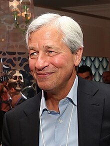

# Jamie Dimon

[Return](./index.md) | [Home](../index.md) | Created 27/08/2024 by [theluqmn](https://github.com/theluqmn), in City, Country

## A look into the CEO of JPMorgan Chase

Born 13th March 1956 in New York City, USA, he is the chairman and chief executive officer (CEO) of JPMorgan Chase since 2006. He was also on the board of directors of the Federal Reserve Bank of New York during the late 2010s. Since then, Dimon has became a board member of Harvard Business School, Business Rountable and the Bank Policy Institute.

Growing up in the Jackson Heights neighbourhood of New York, and is one of three sons of Theodore and Themis Dimon, who had Greek ancestry. Dimon has an older brother named Peter, and a fraternal twin brother, Ted. He attended the **Browning School**, then majored in **psychology** and **economics** at **Tufts University**.

Both his father and grandfather were stockbrokers at **Shearson**. During his study at Tufts, he wrote an essay on Shearson's mergers. His mother sent his essay to **Sandy Weill** - who later hired him to work at Shearson during one summer break to do budget work. After graduating, he worked at the **Boston Consulting Group** for two years, then enrolling to **Harvard Business School**. In the summer at Harvard, he worked for Goldman Sachs. He graduated in 1982, earning an MBA, then was convinced by Sandy Weill to turn down offers from **Goldman Sachs**, **Morgan Stanley** and **Lehman Brothers** to join him as an assistant at **American Express** - he promised Dimon that he would have "fun".

It must be noted that Dimon's father, Theodore, was an **executive vice president** at American Express.

### His personal life

In 1983, Dimon married Judith Kent - who he met in Harvard Business School. They have three daughters: Julia, Laura and Kara Leigh.

He was diagnosed with throat cancer in 2014, and underwent radiation and chemotherapy for eight weeks, ending in September 2014. Dimon also underwent an "emergency heart surgery" in March 2020. He returned to work in a remote capacity in April 2020 due to the COVID-19 pandemic.

He is also known as a family man, and a loving father and grandpa - according to a recent Bloomberg [interview](https://youtu.be/9Kl-wO_j5GM?si=mEbRYI0d9DdEHfZi) by Emily Chang.

### Career in finance

Sandy Weill left American Express in 1985, and Dimon followed him. The two then took over **Commercial Credit** - which is a consumer finance company, from the **Control Data Corporation**. Dimon was the chief finance officer (CFO) at age 30, helping to turn the company around. After a series of mergers and acquisitions, in 1998, he and Weill formed the financial services conglomerate, **Citigroup**. Dimon left Citigroup in November 1998, after being asked by Weill to resign. It was rumoured to be due to personal issues between him and Weill.

March 2000 marked a new chapter in Dimon's life, he became the CEO of **Bank One** - which was the fifth largest bank in the US at the time. When Bank One merged with JPMorgan Chase in July 2004, he became the president and chief operating officer of the combined company. Later, on 31st December 2005, he was named CEO of JPMorgan Chase, and on 31st December 2006, he was named chairman and president.

He is one of the few banking executives to have become a billionaire, largely because of his stake in JPMorgan Chase. As of February 2024, Forbes estimated his net worth at $2 billion.

JPMorgan Chase played a crucial role in stopping the bleeding during the 2008 financial crisis, by acquiring **Bear Stearns** and the **Washington Mutual**. Those acquisitions made Chase the largest commercial bank in the US, and saved the US government in billions of bailouts. It also helped mitigate the damages from the recent collapse of **Silicon Valley Bank** and **First Republic**.

### What made him successful

One of the key reasons why JPMorgan Chase survived the 2008 financial crisis is to what is famously known as the **fortress balance sheet**. In a nutshell, the strategy is to take a cautious approach by never over-leveraging things to the point where banks could not withstand a major unforeseen shock.

### Futher reading

Thank you for reading this far, this is my second post in the new blog! Am still getting used to writing things out but I will not be stopping anytime soon! If you are interested in Jamie Dimon or JPMorgan Chase, here are some links for you to watch and do further reading:

- [Bloomberg interview by Emily Chang](https://youtu.be/9Kl-wO_j5GM?si=mEbRYI0d9DdEHfZi)
- [A fortress balance sheet](https://www.cfo.com/news/a-fortress-balance-sheet/669932/)
- [JPMorgan Chase (wikipedia)](https://en.wikipedia.org/wiki/JPMorgan_Chase#)

----

This post is writen myself, with own thoughts and opinions. AI was only used to find websites and articles to read and reference.
